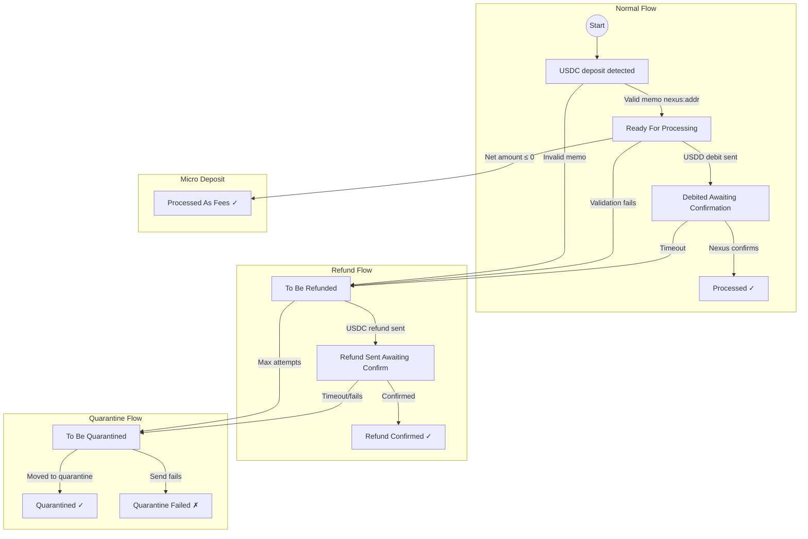
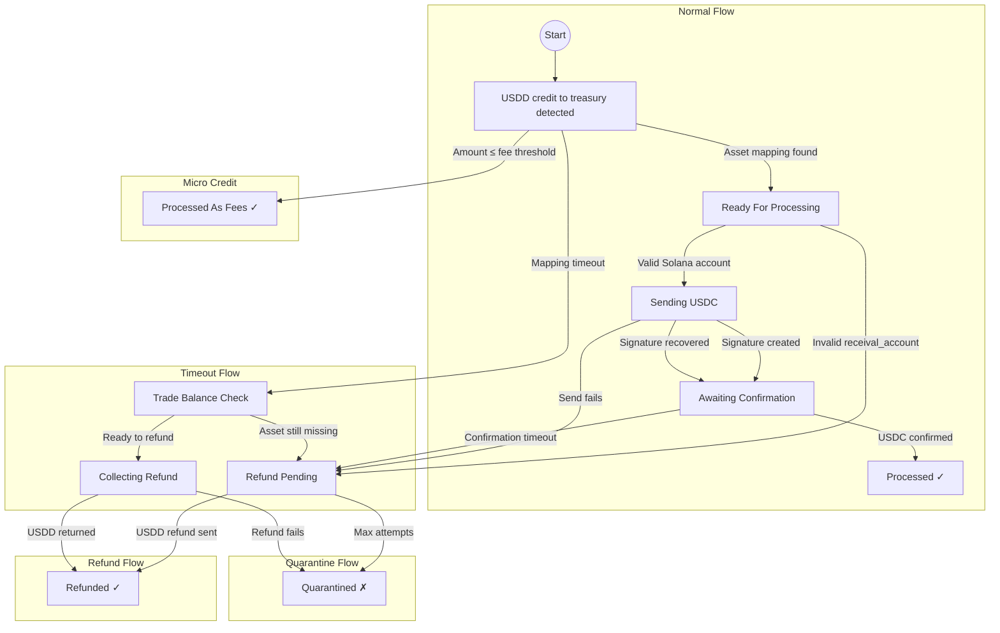

# Swap Service State Machines

This document provides state machine diagrams for both swap directions in the bidirectional USDC ↔ USDD swap service.

---

## USDC → USDD State Machine (Solana to Nexus)



### USDC → USDD State Descriptions

| State | Description | DB Table | Status Field Value |
|-------|-------------|----------|-------------------|
| **Detected** | USDC deposit signature found during polling | `unprocessed_sigs` | N/A (initial) |
| **ReadyForProcessing** | Memo parsed, Nexus account validated | `unprocessed_sigs` | `"ready for processing"` |
| **DebitedAwaitingConfirmation** | USDD debit transaction sent to Nexus | `unprocessed_sigs` | `"debited, awaiting confirmation"` |
| **Processed** | USDD debit confirmed on Nexus | `processed_sigs` | `"debit_confirmed"` or `"processed"` |
| **ProcessedAsFees** | Amount after fees ≤ 0 (micro deposit) | `processed_sigs` | `"processed, amount after fees <= 0"` |
| **ToBeRefunded** | Invalid memo/account, or processing failed | `unprocessed_sigs` | `"to be refunded"` |
| **RefundSentAwaitingConfirmation** | USDC refund transaction sent back | `unprocessed_sigs` | `"refund sent, awaiting confirmation"` |
| **RefundConfirmed** | Refund confirmed on Solana | `refunded_sigs` | `"refund_confirmed"` |
| **ToBeQuarantined** | Refund attempts exhausted | `unprocessed_sigs` | `"to be quarantined"` |
| **QuarantinedConfirmed** | Funds moved to quarantine account | `quarantined_sigs` | `"quarantine sent, awaiting confirmation"` |

### Key Transitions (USDC → USDD)

- **Normal Flow**: Detected → ReadyForProcessing → DebitedAwaitingConfirmation → Processed
- **Refund Flow**: Any failure → ToBeRefunded → RefundSentAwaitingConfirmation → RefundConfirmed
- **Quarantine Flow**: Max attempts → ToBeQuarantined → QuarantinedConfirmed
- **Micro Deposit**: ReadyForProcessing → ProcessedAsFees (if net amount ≤ 0)

---

## USDD → USDC State Machine (Nexus to Solana)



### USDD → USDC State Descriptions

| State | Description | DB Table | Status Field Value |
|-------|-------------|----------|-------------------|
| **PendingReceival** | USDD credit detected, awaiting asset mapping | `unprocessed_txids` | `"pending_receival"` |
| **ReadyForProcessing** | Asset mapping resolved with valid receival account | `unprocessed_txids` | `"ready for processing"` |
| **Sending** | USDC send in progress (before signature) | `unprocessed_txids` | `"sending"` |
| **AwaitingConfirmation** | USDC signature created, awaiting confirmations | `unprocessed_txids` | `"sig created, awaiting confirmations"` |
| **Processed** | USDC confirmed on Solana | `processed_txids` | `"processed"` |
| **ProcessedAsFees** | Amount below threshold (micro credit) | `processed_txids` | `"processed as fees"` |
| **RefundPending** | Failed processing, refund initiated | `unprocessed_txids` | `"refund pending"` |
| **TradeBalanceCheck** | Mapping timeout, checking for recovery | `unprocessed_txids` | `"trade balance to be checked"` |
| **CollectingRefund** | Refund in collection process | `unprocessed_txids` | `"collecting refund"` |
| **Refunded** | USDD refunded successfully | `refunded_txids` | `"refunded"` |
| **Quarantined** | All refund attempts failed | `quarantined_txids` | `"quarantined"` |

### Processing Priority Order (USDD → USDC)

The `process_unprocessed_txids()` function handles states in priority order:

| Priority | Status Handled | Action |
|----------|----------------|--------|
| 1 | `pending_receival` (confirmed) | Resolve `receival_account` via asset lookup |
| 2 | `ready for processing` | Send USDC with memo `nexus_txid:<txid>` |
| 3 | `sig created, awaiting confirmations` | Check for USDC confirmation or timeout |
| 4 | `trade balance to be checked` | Retry asset lookup or move to `collecting refund` |
| 5 | `collecting refund` | Execute USDD refund or quarantine |
| 6 | `refund pending` | Execute USDD refund or quarantine |

### Key Transitions (USDD → USDC)

- **Normal Flow**: PendingReceival → ReadyForProcessing → Sending → AwaitingConfirmation → Processed
- **Refund Flow**: Any failure → RefundPending → Refunded
- **Timeout Flow**: PendingReceival → TradeBalanceCheck → CollectingRefund → Refunded
- **Quarantine Flow**: Max attempts → Quarantined
- **Micro Credit**: PendingReceival → ProcessedAsFees (if amount ≤ `MIN_CREDIT_USDD`)

---

## State Transition Triggers & Timeouts

### USDC → USDD Timeouts

| Timeout | Config Variable | Default | Purpose | Handler |
|---------|----------------|---------|---------|--------|
| Refund timeout | `REFUND_TIMEOUT_SEC` | 3600s (1h) | Age before forced refund for unresolved memo | `poll_solana_deposits()` |
| Confirmation timeout | `USDC_CONFIRM_TIMEOUT_SEC` | 600s (10m) | Max wait for debit confirmation on Nexus | `check_unconfirmed_debits()` |
| Stale quarantine | `STALE_DEPOSIT_QUARANTINE_SEC` | 86400s (24h) | Age to quarantine stuck deposits | `_process_stale_deposits()` |

### USDD → USDC Timeouts

| Timeout | Config Variable | Default | Purpose |
|---------|----------------|---------|---------|
| Asset mapping timeout | `REFUND_TIMEOUT_SEC` | 3600s (1h) | Max wait for receival_account asset |
| USDC confirmation timeout | `USDC_CONFIRM_TIMEOUT_SEC` | 600s (10m) | Max wait for USDC send confirmation |

### Retry Logic

Both directions use attempt tracking with configurable limits:
- **Max attempts**: `MAX_ACTION_ATTEMPTS` (default: 3)
- **Cooldown**: `ACTION_RETRY_COOLDOWN_SEC` (default: 300s / 5m)

After max attempts exhausted:
- USDC → USDD: Funds quarantined to `USDC_QUARANTINE_ACCOUNT`
- USDD → USDC: Funds quarantined to `NEXUS_USDD_QUARANTINE_ACCOUNT`
- Event recorded in `quarantined_sigs` or `quarantined_txids` database table


---

## State Persistence

### Database Tables

| Table | Purpose | Swap Direction |
|-------|---------|----------------|
| `unprocessed_sigs` | Active Solana deposits being processed | USDC → USDD |
| `processed_sigs` | Completed/confirmed Solana deposits | USDC → USDD |
| `refunded_sigs` | Refunded Solana deposits | USDC → USDD |
| `quarantined_sigs` | Quarantined Solana deposits | USDC → USDD |
| `unprocessed_txids` | Active Nexus credits being processed | USDD → USDC |
| `processed_txids` | Completed/confirmed Nexus credits | USDD → USDC |
| `refunded_txids` | Refunded Nexus credits | USDD → USDC |
| `quarantined_txids` | Quarantined Nexus credits | USDD → USDC |

### Idempotency Guarantees

#### USDC → USDD
- Solana signature is primary key in database
- Memo contains unique Nexus address
- Debit reference counter ensures uniqueness
- Startup recovery scans memos for `processedTxid:<txid>` patterns

#### USDD → USDC
- Nexus txid is primary key in database
- Asset mapping validated by (txid, owner) tuple
- USDC memo format: `nexus_txid:<txid>` for recovery
- Startup recovery scans memos to rebuild processed sets

---

## Edge Cases & Error Handling

### USDC → USDD Edge Cases

| Scenario | State Transition | Resolution |
|----------|------------------|------------|
| Invalid Nexus address format | Detected → ToBeRefunded | Refund with memo explaining error |
| Nexus account doesn't exist | ReadyForProcessing → ToBeRefunded | Refund minus flat fee |
| Network failure during debit | DebitedAwaitingConfirmation → ToBeRefunded | Retry with cooldown, then refund |
| Refund send fails | RefundSentAwaitingConfirmation → ToBeQuarantined | Move to quarantine after max attempts |
| Amount ≤ fees | ReadyForProcessing → ProcessedAsFees | Treated as donation/fee |

### USDD → USDC Edge Cases

| Scenario | State Transition | Resolution |
|----------|------------------|------------|
| No asset mapping published | PendingReceival → TradeBalanceCheck | Wait until timeout, then refund |
| Invalid Solana address | ReadyForProcessing → RefundPending | Immediate refund minus congestion fee |
| USDC ATA doesn't exist | ReadyForProcessing → RefundPending | Refund (service won't create ATA) |
| Asset owner mismatch | PendingReceival (ignored) | No state change, wait for correct owner |
| USDC send fails | Sending → RefundPending | Retry, then refund after max attempts |
| Amount ≤ fees | PendingReceival → ProcessedAsFees | No USDC sent, treated as fee |

---

## Monitoring State Transitions

### Key Metrics to Monitor

1. **State Distribution**: Count of signatures/txids in each state
2. **Dwell Time**: Average time spent in each state
3. **Transition Success Rate**: % of deposits reaching `Processed` vs `Refunded`/`Quarantined`
4. **Backlog Size**: Total `unprocessed_sigs` + `unprocessed_txids` count
5. **Quarantine Rate**: % of transactions ending in quarantine (should be near 0%)

### Alerting Thresholds

- **High Refund Rate**: >5% of transactions refunded (investigate validation logic)
- **Growing Backlog**: Unprocessed count increasing over time (check polling frequency)
- **Quarantine Events**: Any quarantined transaction (immediate manual review)
- **Long Dwell Time**: Transactions stuck in `AwaitingConfirmation` >10m (RPC issues?)

### SQL Queries for State Analysis

```sql
-- USDC → USDD state distribution
SELECT status, COUNT(*) as count 
FROM unprocessed_sigs 
GROUP BY status;

-- USDD → USDC state distribution
SELECT status, COUNT(*) as count 
FROM unprocessed_txids 
GROUP BY status;

-- Oldest unprocessed by state
SELECT sig, timestamp, status, memo 
FROM unprocessed_sigs 
ORDER BY timestamp ASC 
LIMIT 10;

-- Recent quarantines (investigate)
SELECT sig, timestamp, from_address, amount_usdc_units, memo
FROM quarantined_sigs
WHERE timestamp > (strftime('%s', 'now') - 86400)
ORDER BY timestamp DESC;
```

---

## Recovery Procedures

### After Service Restart

The `startup_recovery.py` module automatically:
1. Fetches waterlines from heartbeat asset
2. Scans on-chain transactions since waterline
3. Rebuilds `processed_*` markers from memo patterns:
   - `nexus_txid:<txid>` → processed USDD→USDC swap
   - `refundSig:<sig>` → refunded USDC deposit
   - `quarantinedSig:<sig>` → quarantined deposit
4. Seeds reference counter if missing

### Manual State Repair (Rare)

If database corruption occurs:
1. Stop service
2. Backup `swap_service.db`
3. Use waterline-based recovery:
   ```python
   from src import startup_recovery
   result = startup_recovery.perform_startup_recovery()
   print(result)
   ```
4. Review discrepancies before restarting

---

## State Machine Implementation Details

### Code Locations

| Component | File | Function/Section |
|-----------|------|------------------|
| USDC→USDD polling | `src/swap_solana.py` | `poll_solana_deposits()` |
| USDC→USDD processing | `src/solana_client.py` | `process_unprocessed_usdc_deposits()` |
| USDC refunds | `src/solana_client.py` | `process_usdc_deposits_refunding()` |
| USDC quarantine | `src/solana_client.py` | `process_usdc_deposits_quarantine()` |
| USDD→USDC polling | `src/swap_nexus.py` | `poll_nexus_usdd_deposits()` |
| USDD→USDC processing | `src/swap_nexus.py` | `process_unprocessed_txids()` |
| State transitions | `src/state_db.py` | `update_unprocessed_sig()`, `update_unprocessed_txid()` |
| Startup recovery | `src/startup_recovery.py` | `perform_startup_recovery()` |

### Status Constants

Defined in `src/swap_nexus.py`:
```python
USDD_STATUS_PENDING = "pending_receival"
USDD_STATUS_READY = "ready for processing"
USDD_STATUS_SENDING = "sending"
USDD_STATUS_AWAITING = "sig created, awaiting confirmations"
USDD_STATUS_REFUNDED = "refunded"
USDD_STATUS_PROCESSED = "processed"
USDD_STATUS_FEES = "processed as fees"
USDD_STATUS_REFUND_PENDING = "refund pending"
USDD_STATUS_QUARANTINED = "quarantined"
```

---

## References

- Full configuration: [CONFIG.md](CONFIG.md)
- Security hardening: [SECURITY.md](SECURITY.md)
- Operational setup: [SETUP.md](SETUP.md)
- User guide: [README.md](README.md)
- Database schema: [STATE_DB_MIGRATION.md](STATE_DB_MIGRATION.md)
