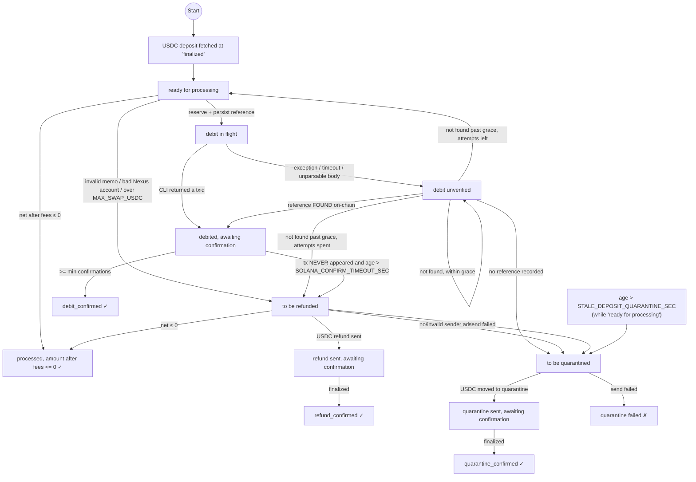
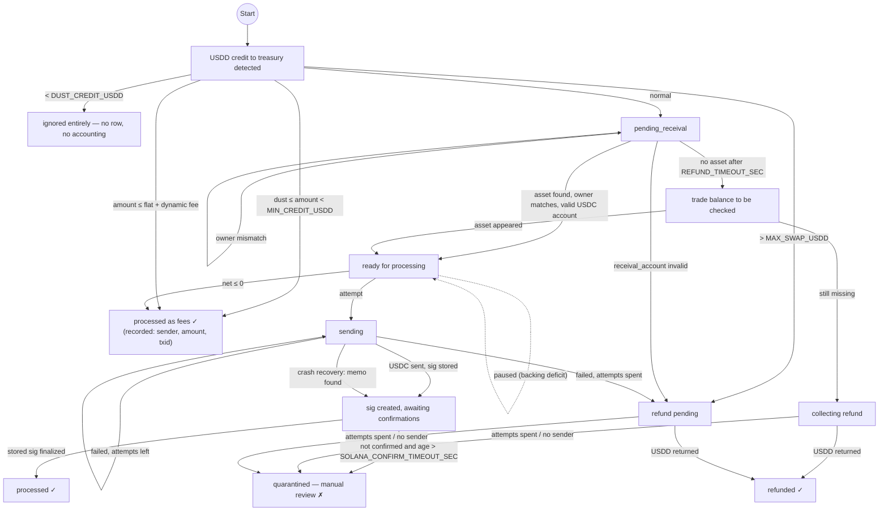

# Swap Service State Machines

State machine diagrams for both swap directions in the bidirectional USDC ↔ USDD swap service.

> **Accuracy note (2026-06-15):** this document was re-derived directly from the code. The
> previous version contained transitions the code does not perform (notably an
> auto-refund on debit timeout, and a refund on USDC-confirmation timeout) and omitted the
> ambiguity-resolution states. Status strings below are copied verbatim from the source.

---

## USDC → USDD State Machine (Solana to Nexus)


```mermaid
flowchart TD
    START((Start)) --> Detected[USDC deposit fetched at 'finalized']
    Detected --> ReadyForProcessing["ready for processing"]

    ReadyForProcessing -->|invalid memo / bad Nexus account / over MAX_SWAP_USDC| ToBeRefunded["to be refunded"]
    ReadyForProcessing -->|"net after fees ≤ 0"| ProcessedAsFees["processed, amount after fees <= 0 ✓"]
    ReadyForProcessing -->|"reserve + persist reference"| DebitInFlight["debit in flight"]

    DebitInFlight -->|CLI returned a txid| DebitedAwaiting["debited, awaiting confirmation"]
    DebitInFlight -->|"exception / timeout / unparsable body"| DebitUnverified["debit unverified"]

    DebitUnverified -->|reference FOUND on-chain| DebitedAwaiting
    DebitUnverified -->|"not found, within grace"| DebitUnverified
    DebitUnverified -->|"not found past grace, attempts left"| ReadyForProcessing
    DebitUnverified -->|"not found past grace, attempts spent"| ToBeRefunded
    DebitUnverified -->|no reference recorded| ToBeQuarantined["to be quarantined"]

    DebitedAwaiting -->|">= min confirmations"| Processed["debit_confirmed ✓"]
    DebitedAwaiting -->|"tx NEVER appeared and age > SOLANA_CONFIRM_TIMEOUT_SEC"| ToBeRefunded

    ToBeRefunded -->|"net ≤ 0"| ProcessedAsFees
    ToBeRefunded -->|"no/invalid sender address"| ToBeQuarantined
    ToBeRefunded -->|USDC refund sent| RefundSent["refund sent, awaiting confirmation"]
    ToBeRefunded -->|send failed| ToBeQuarantined
    RefundSent -->|finalized| RefundConfirmed["refund_confirmed ✓"]

    ToBeQuarantined -->|USDC moved to quarantine| QuarantineSent["quarantine sent, awaiting confirmation"]
    ToBeQuarantined -->|send failed| QuarantineFailed["quarantine failed ✗"]
    QuarantineSent -->|finalized| QuarantineConfirmed["quarantine_confirmed ✓"]

    Stale["age > STALE_DEPOSIT_QUARANTINE_SEC<br/>(while 'ready for processing')"] --> ToBeQuarantined
```

### USDC → USDD State Descriptions

| State | Description | Table | Status value |
|-------|-------------|-------|--------------|
| **Detected** | Deposit fetched from Solana (at `SOLANA_DEPOSIT_COMMITMENT`, default `finalized`) | `unprocessed_sigs` | `"ready for processing"` on insert |
| **ReadyForProcessing** | Awaiting validation + debit | `unprocessed_sigs` | `"ready for processing"` |
| **DebitInFlight** | Reference persisted, Nexus debit issued, outcome not yet known | `unprocessed_sigs` | `"debit in flight"` |
| **DebitUnverified** | Debit outcome **ambiguous** — resolved against the chain, never guessed | `unprocessed_sigs` | `"debit unverified"` |
| **DebitedAwaiting** | Debit confirmed to exist; awaiting confirmations | `unprocessed_sigs` | `"debited, awaiting confirmation"` |
| **Processed** | Debit fully confirmed | `processed_sigs` | `"debit_confirmed"` |
| **ProcessedAsFees** | Amount after fees ≤ 0 | `processed_sigs` | `"processed, amount after fees <= 0"` |
| **ToBeRefunded** | Validation failed, over cap, or debit provably never landed | `unprocessed_sigs` | `"to be refunded"` |
| **RefundSent** | USDC refund broadcast | `unprocessed_sigs` | `"refund sent, awaiting confirmation"` |
| **RefundConfirmed** | Refund finalized | `refunded_sigs` | `"awaiting confirmation"` → `"refund_confirmed"` |
| **ToBeQuarantined** | Refund impossible or attempts spent | `unprocessed_sigs` | `"to be quarantined"` |
| **QuarantineSent** | USDC moved to `USDC_QUARANTINE_ACCOUNT` | `unprocessed_sigs` | `"quarantine sent, awaiting confirmation"` |
| **QuarantineConfirmed** | Quarantine finalized | `quarantined_sigs` | `"awaiting confirmation"` → `"quarantine_confirmed"` |
| **QuarantineFailed** | Quarantine send failed | `unprocessed_sigs` | `"quarantine failed"` |

> **Ambiguity is never treated as failure.** `debit_nexus_token_with_txid()` returns `(False, None)`
> both when the CLI failed *and* when it succeeded but the response could not be parsed.
> Refunding on that signal would mint USDD **and** return the USDC. Instead the row goes to
> `debit unverified` and `resolve_unverified_debits()` asks the chain, keyed on the unique
> per-attempt `reference` persisted *before* the call.

---

## USDD → USDC State Machine (Nexus to Solana)


```mermaid
flowchart TD
    START((Start)) --> Credit[USDD credit to treasury detected]

    Credit -->|"< DUST_CREDIT_USDD"| Ignored["ignored entirely — no row, no accounting"]
    Credit -->|"dust ≤ amount < MIN_CREDIT_USDD"| FeesRecorded["processed as fees ✓<br/>(recorded: sender, amount, txid)"]
    Credit -->|"amount ≤ flat + dynamic fee"| FeesRecorded
    Credit -->|"> MAX_SWAP_USDD"| RefundPending["refund pending"]
    Credit -->|normal| Pending["pending_receival"]

    Pending -->|"asset found, owner matches, valid USDC account"| Ready["ready for processing"]
    Pending -->|owner mismatch| Pending
    Pending -->|"receival_account invalid"| RefundPending
    Pending -->|"no asset after REFUND_TIMEOUT_SEC"| TradeBal["trade balance to be checked"]

    Ready -->|"vault cannot cover payout"| Ready
    Ready -->|"net ≤ 0"| FeesRecorded
    Ready -->|attempt| Sending["sending"]
    Ready -.->|"paused (backing deficit)"| Ready

    Sending -->|"USDC sent, sig stored"| Awaiting["sig created, awaiting confirmations"]
    Sending -->|"failed, attempts left"| Sending
    Sending -->|"failed, attempts spent"| RefundPending
    Sending -->|"crash recovery: memo found"| Awaiting

    Awaiting -->|"stored sig finalized"| Processed["processed ✓"]
    Awaiting -->|"not confirmed and age > SOLANA_CONFIRM_TIMEOUT_SEC"| Quarantined["quarantined — manual review ✗"]

    TradeBal -->|asset appeared| Ready
    TradeBal -->|still missing| Collecting["collecting refund"]

    Collecting -->|USDD returned| Refunded["refunded ✓"]
    Collecting -->|"attempts spent / no sender"| Quarantined
    RefundPending -->|USDD returned| Refunded
    RefundPending -->|"attempts spent / no sender"| Quarantined
```

### USDD → USDC State Descriptions

| State | Description | Table | Status value |
|-------|-------------|-------|--------------|
| **Ignored** | Below `DUST_CREDIT_USDD` — spam floor, deliberately no trace | — | — |
| **FeesRecorded** | Below `MIN_CREDIT_USDD` or ≤ fees; **recorded** so funds stay traceable | `processed_txids` | `"processed as fees"` |
| **Pending** | Credit queued, awaiting asset mapping | `unprocessed_txids` | `"pending_receival"` |
| **Ready** | Mapping resolved and owner-verified | `unprocessed_txids` | `"ready for processing"` |
| **Sending** | USDC send attempted | `unprocessed_txids` | `"sending"` |
| **Awaiting** | Signature stored, awaiting finality | `unprocessed_txids` | `"sig created, awaiting confirmations"` |
| **Processed** | USDC delivered | `processed_txids` | `"processed"` |
| **TradeBal** | Mapping timed out; one more lookup before refunding | `unprocessed_txids` | `"trade balance to be checked"` |
| **Collecting** | Refund being collected | `unprocessed_txids` | `"collecting refund"` |
| **RefundPending** | Refund queued | `unprocessed_txids` | `"refund pending"` |
| **Refunded** | USDD returned to sender | `refunded_txids` | `"refunded"` |
| **Quarantined** | Manual review; USDD **moved** to `NEXUS_USDD_QUARANTINE_ACCOUNT` | `quarantined_txids` | `"quarantined"`, or `"quarantined (USDD NOT moved)"` if that account is unset |

> **A USDC-confirmation timeout quarantines — it does not refund.** The USDC may in fact
> have been sent and only the lookup failed; refunding would pay twice.

### Processing Priority Order (`process_unprocessed_txids`)

| Priority | Status handled | Action | Skipped while paused |
|----------|----------------|--------|----------------------|
| 1 | `pending_receival` (confirmations > 1) | Resolve `receival_account` by (`txid_toService`, `owner`) | No |
| 2 | `ready for processing` | Liquidity check, then send USDC with memo `nexus_txid:<txid>` | **Yes** |
| 3 | `sig created, awaiting confirmations` | Confirm the stored signature; memo scan only as fallback | No |
| 4 | `trade balance to be checked` | Retry lookup, else → `collecting refund` | No |
| 5 | `collecting refund` | Refund USDD, else quarantine | No |
| 6 | `refund pending` | Refund USDD, else quarantine | No |

---

## Paused Mode (Backing Deficit)

When `fees.maintain_backing_and_bounds()` reports a deficit (vault USDC below
`BACKING_DEFICIT_PAUSE_PCT`% of circulating USDD), the loop does **not** skip the cycle.
It runs both pollers with `paused=True`:

| Continues | Stops |
|-----------|-------|
| USDC refunds, quarantine, confirmation checks | New deposit ingestion |
| USDD refunds, quarantine, ambiguity resolution | USDC→USDD debits |
| Waterline held (no fetch ⇒ no advance) | USDD→USDC USDC sends |

A failure of the backing check itself also fails safe to paused. A `backing_deficit_pause`
alert is emitted.

---

## Timeouts & Retry

| Timeout | Config | Default | Applies to | Handler |
|---------|--------|---------|-----------|---------|
| Asset-mapping timeout | `REFUND_TIMEOUT_SEC` | 3600s | **USDD→USDC only** | `process_unprocessed_txids()` P1 |
| Debit-confirmation timeout | `SOLANA_CONFIRM_TIMEOUT_SEC` | 600s | USDC→USDD (tx never appeared) | `check_unconfirmed_debits()` |
| USDC-confirmation timeout | `SOLANA_CONFIRM_TIMEOUT_SEC` | 600s | USDD→USDC → **quarantine** | `process_unprocessed_txids()` P3 |
| Ambiguous-debit grace | `DEBIT_VERIFY_GRACE_SEC` | 300s | USDC→USDD | `resolve_unverified_debits()` |
| Stale deposit | `STALE_DEPOSIT_QUARANTINE_SEC` | 86400s | USDC→USDD | `_process_stale_deposits()` |

**Retry:** `MAX_ACTION_ATTEMPTS` (3) attempts, with `ACTION_RETRY_COOLDOWN_SEC` (300s)
enforced between them. `should_attempt()` returns False for *either* reason;
`attempts_exhausted()` distinguishes them, so a cooldown never causes a premature
quarantine. After exhaustion, USDC goes to `USDC_QUARANTINE_ACCOUNT` and USDD is
transferred to `NEXUS_USDD_QUARANTINE_ACCOUNT`.

---

## State Persistence

| Table | Purpose |
|-------|---------|
| `unprocessed_sigs` / `processed_sigs` / `refunded_sigs` / `quarantined_sigs` | USDC→USDD lifecycle |
| `unprocessed_txids` / `processed_txids` / `refunded_txids` / `quarantined_txids` | USDD→USDC lifecycle |
| `attempts` | Retry counters + `last_timestamp` (cooldown) |
| `reservations` | Cross-worker mutual exclusion on money actions |
| `counters` | Atomic Nexus debit `reference` sequence |
| `payouts` | Outbound USDC ledger for the rolling 24h cap |
| `fee_entries` / `fee_summary` | Authoritative fee ledger |
| `waterline_proposals` / `heartbeat` | Waterline plumbing and last known-good values |
| `accounts` | Cached balances |

SQLite runs in **WAL** mode (set in `init_db()`).

### Idempotency Guarantees

**USDC → USDD**
- Solana signature is the primary key; `processed`/`refunded`/`quarantined` sets are checked before acting.
- A unique `reference` is persisted **before** each debit and is the on-chain lookup key for ambiguity resolution.
- `reserve_action("usdc_to_usdd_debit", sig)` prevents two workers acting on one deposit.
- Refund/quarantine sends carry `refundSig:<sig>` / `quarantinedSig:<sig>` memos, checked on-chain before a retry re-sends.

**USDD → USDC**
- Nexus txid is the primary key; mapping validated on (`txid_toService`, `owner`).
- USDC sends carry `nexus_txid:<txid>`; the resulting signature is stored in `unprocessed_txids.sig`.
- Startup recovery rebuilds markers from `nexus_txid:`, `refundSig:` and `quarantinedSig:` memos.

---

## Waterline Invariant

`_advance_solana_waterline()` may only move the Solana waterline to a point proven safe:

| Situation | Waterline |
|-----------|-----------|
| Deposit enumeration failed | held entirely |
| Unprocessed deposits exist | pinned behind the oldest |
| Deposit withheld pending finalization | pinned behind it |
| Everything fetched is persisted | `poll_start − HEARTBEAT_WATERLINE_SAFETY_SEC` |
| Candidate ≤ current | unchanged (never moves backwards) |

A waterline read ahead of *now* is clamped. **The waterline must never pass a deposit that
is not durably recorded** — `_fetch_deposits_helius` stops at `ts <= since_ts`, so anything
left behind it is never seen again.

---

## Code Locations

| Component | File | Function |
|-----------|------|----------|
| USDC→USDD polling | `src/swap_solana.py` | `poll_solana_deposits()` |
| Waterline advance | `src/swap_solana.py` | `_advance_solana_waterline()` |
| USDC→USDD processing | `src/solana_client.py` | `process_unprocessed_solana_deposits()` |
| Ambiguity resolution | `src/nexus_client.py` | `resolve_unverified_debits()`, `find_nexus_debit_by_reference()` |
| USDC refunds / quarantine | `src/solana_client.py` | `process_solana_deposits_refunding()`, `process_solana_deposits_quarantine()` |
| USDD→USDC polling | `src/swap_nexus.py` | `poll_nexus_deposits()` |
| USDD→USDC processing | `src/swap_nexus.py` | `process_unprocessed_txids()` |
| USDD quarantine transfer | `src/nexus_client.py` | `quarantine_nexus_token()` |
| Alerting | `src/alerts.py` | `critical()`, `warning()`, `info()` |
| Startup recovery | `src/startup_recovery.py` | `perform_startup_recovery()` |

### Status Constants (`src/swap_nexus.py`)

```python
USDD_STATUS_PENDING          = "pending_receival"
USDD_STATUS_READY            = "ready for processing"
USDD_STATUS_SENDING          = "sending"
USDD_STATUS_AWAITING         = "sig created, awaiting confirmations"
USDD_STATUS_REFUNDED         = "refunded"
USDD_STATUS_PROCESSED        = "processed"
USDD_STATUS_FEES             = "processed as fees"
USDD_STATUS_REFUND_PENDING   = "refund pending"
USDD_STATUS_QUARANTINED      = "quarantined"
USDD_STATUS_TRADE_BAL_CHECK  = "trade balance to be checked"
USDD_STATUS_COLLECTING_REFUND = "collecting refund"
```

USDC-side statuses are string literals in `src/solana_client.py` / `src/nexus_client.py`
(listed in the table above) rather than named constants.

> **Known inconsistency:** `_process_stale_deposits()` also matches a `'memo unresolved'`
> status that no code path ever writes. Harmless, but it is dead.

---

## Monitoring

```sql
-- state distribution
SELECT status, COUNT(*) FROM unprocessed_sigs  GROUP BY status;
SELECT status, COUNT(*) FROM unprocessed_txids GROUP BY status;

-- ambiguous debits needing chain resolution (should drain quickly)
SELECT sig, reference, status FROM unprocessed_sigs
WHERE status IN ('debit in flight','debit unverified');

-- rolling 24h outbound USDC vs cap
SELECT COALESCE(SUM(amount_usdc_units),0) FROM payouts
WHERE timestamp >= strftime('%s','now') - 86400;

-- quarantined USDD actually moved?
SELECT txid, amount_usdd, status FROM quarantined_txids ORDER BY timestamp DESC;
```

Alerts (`ALERT_WEBHOOK_URL` / `ALERT_COMMAND`) fire on: `backing_deficit_pause`,
`unbacked_usdd_surplus`, `heartbeat_unreadable`, `heartbeat_asset_invalid`,
`insufficient_vault_liquidity`, `payout_cap_exceeded`, `swap_over_cap`, `usdd_quarantined`.

---

## References

- User-facing flow: [SWAP_INITIATOR_STATE_MACHINES.md](SWAP_INITIATOR_STATE_MACHINES.md)
- Configuration: [CONFIG.md](CONFIG.md)
- Security hardening: [SECURITY.md](SECURITY.md)
- Operational setup: [SETUP.md](SETUP.md)
- Risk assessment: [RISK_ASSESSMENT.md](RISK_ASSESSMENT.md)
