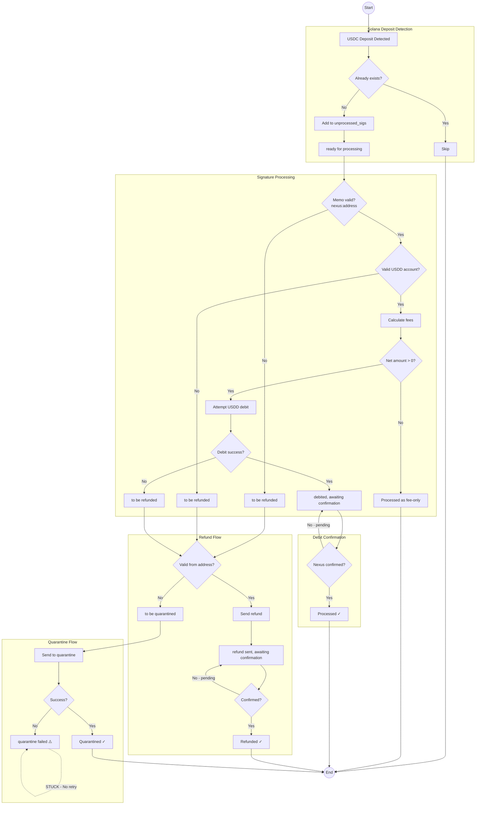
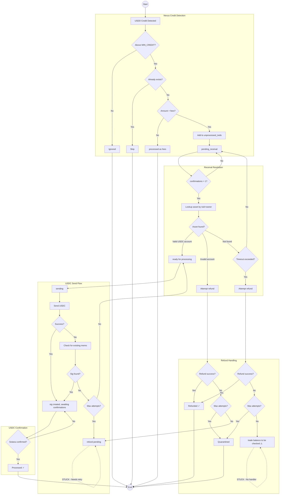
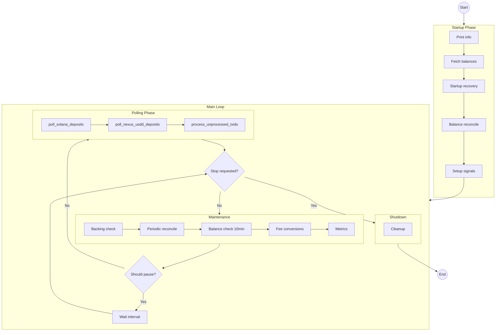
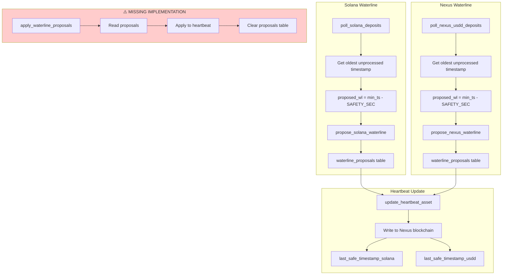
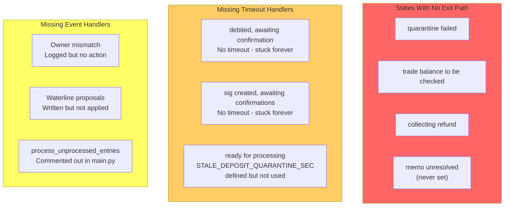
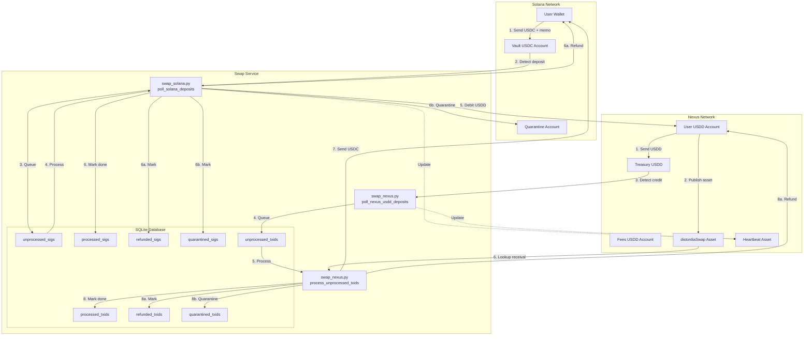

# State Machine Diagrams (Mermaid Format)

These diagrams can be rendered in GitHub, VS Code (with Mermaid extension), or any Mermaid-compatible viewer.

## 1. USDC→USDD Complete Flow

## 2. USDD→USDC Complete Flow

## 3. Main Event Loop

## 4. Fee Calculation Flow

```mermaid
flowchart TD
    subgraph USDC_to_USDD["USDC → USDD Fees"]
        A1[Deposit Amount USDC] --> B1{Amount >= MIN_DEPOSIT?}
        B1 -->|No| C1[100% Fee - Ignored]
        B1 -->|Yes| D1[Subtract FLAT_FEE_USDC_UNITS]
        D1 --> E1[Calculate DYNAMIC_FEE_BPS]
        E1 --> F1[Net USDD = Amount - Flat - Dynamic]
        F1 --> G1{Net > 0?}
        G1 -->|No| H1[Mark as fee-only]
        G1 -->|Yes| I1[Debit USDD to user]
    end

    subgraph USDD_to_USDC["USDD → USDC Fees"]
        A2[Credit Amount USDD] --> B2{Amount >= MIN_CREDIT?}
        B2 -->|No| C2[Ignored entirely]
        B2 -->|Yes| D2[Subtract FLAT_FEE_USDD]
        D2 --> E2[Calculate DYNAMIC_FEE_BPS]
        E2 --> F2[Net USDC = Amount - Flat - Dynamic]
        F2 --> G2{Net > 0?}
        G2 -->|No| H2[Mark as fees]
        G2 -->|Yes| I2[Send USDC to user]
    end

    subgraph Reconciliation["Backing Reconciliation"]
        R1[vault_usdc] --> R2[circ_usdd]
        R2 --> R3{vault > circ?}
        R3 -->|No| R4[Check PAUSE threshold]
        R3 -->|Yes| R5[surplus = vault - circ]
        R5 --> R6{surplus >= threshold?}
        R6 -->|Yes| R7[Mint USDD to fees account]
        R6 -->|No| R8[No action]
        R4 --> R9{vault < 90% circ?}
        R9 -->|Yes| R10[PAUSE SERVICE]
        R9 -->|No| R11[Continue]
    end
```

## 5. Waterline Management

## 6. Gap Analysis - Stuck States

## 7. Complete System Flow

