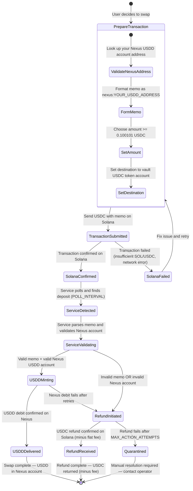
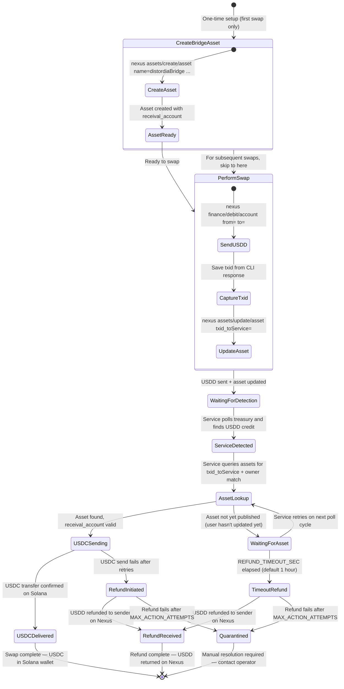

# Swap Initiator State Machines

This document describes the swap process **from the perspective of the swap initiator** (the user sending tokens to the service). It complements `STATE_MACHINES.md` which documents the service's internal processing states.

---

## USDC to USDD — Initiator State Machine (Solana to Nexus)

The user sends USDC on Solana and receives USDD on Nexus.

### Prerequisites

- A Solana wallet with USDC balance (e.g., Phantom, Solflare, or CLI)
- The wallet must support attaching a **memo** to SPL token transfers
- A valid Nexus USDD token account to receive USDD
- Minimum amount: `0.100101 USDC` (amounts below this are treated as fees)

### State Diagram



### State Descriptions

| # | Initiator State | What the User Did / Sees | Service State | Typical Duration |
|---|-----------------|--------------------------|---------------|------------------|
| 1 | **PrepareTransaction** | Gathering destination address, amount, and memo | N/A | User-dependent |
| 2 | **TransactionSubmitted** | Sent USDC transfer with memo on Solana | Not yet visible | Seconds |
| 3 | **SolanaFailed** | Transaction rejected by Solana (insufficient funds, bad signature) | N/A | Immediate |
| 4 | **SolanaConfirmed** | Transaction confirmed on Solana (visible in explorer) | Not yet detected | 1-2 Solana slots (~0.4-0.8s) |
| 5 | **ServiceDetected** | Waiting — deposit detected by service | `unprocessed_sigs` — `ready for processing` | Up to `POLL_INTERVAL` (default 10s) |
| 6 | **ServiceValidating** | Waiting — service validating memo and Nexus account | `unprocessed_sigs` — being processed | Seconds |
| 7 | **USDDMinting** | Waiting — USDD debit sent to Nexus, awaiting confirmation | `unprocessed_sigs` — `debited, awaiting confirmation` | Nexus block time (~50s) |
| 8 | **USDDDelivered** | USDD received in Nexus account | `processed_sigs` — `debit_confirmed` | Terminal |
| 9 | **RefundInitiated** | Waiting for refund | `unprocessed_sigs` — `to be refunded` | Up to `ACTION_RETRY_COOLDOWN_SEC` |
| 10 | **RefundReceived** | USDC returned to original Solana token account (minus flat fee) | `refunded_sigs` — `refund_confirmed` | Terminal |
| 11 | **Quarantined** | Funds held by service; manual review needed | `quarantined_sigs` | Requires operator action |

### Fee Schedule (USDC to USDD)

| Fee | Amount | When Applied |
|-----|--------|--------------|
| Flat fee | `FLAT_FEE_USDD` (default 0.1 USDC-equivalent) | Deducted from swap amount |
| Dynamic fee | `DYNAMIC_FEE_BPS` / 10000 of amount (default 0.1%) | Deducted from swap amount |
| Refund fee | `FLAT_FEE_USDD` (default 0.1 USDC) | Deducted from refund amount |
| Micro deposit (amount <= fees) | 100% — entire amount kept as fee | No USDD sent |

**Net USDD received** = `USDC_amount - flat_fee - (USDC_amount * dynamic_fee_bps / 10000)`

### What to Do at Each Stage

| Situation | User Action |
|-----------|-------------|
| Transaction pending on Solana | Wait for confirmation; check Solana explorer |
| Transaction confirmed but no USDD yet | Wait up to 2-3 poll intervals; check the service heartbeat asset |
| USDD received | Swap complete; verify in Nexus wallet |
| USDC refunded | Check memo for reason; fix and retry if desired |
| No USDD and no refund after 1+ hour | Check service heartbeat; contact operator if service appears down |
| Amount below minimum | Amount is treated as a fee; do not send below `0.100101 USDC` |

### Step-by-Step Instructions

1. **Verify your Nexus USDD account exists** — use `nexus register/get/finance:account name=USDD` or query by address.

2. **Send USDC on Solana** with memo:
   ```
   Destination: <VAULT_USDC_ACCOUNT>  (e.g., Bg1MUQDMjAuXSAFr8izhGCUUhsrta1EjHcTvvgFnJEzZ)
   Memo:        nexus:<YOUR_NEXUS_USDD_ACCOUNT_ADDRESS>
   Amount:      >= 0.100101 USDC
   ```

   Using Solana CLI:
   ```bash
   spl-token transfer EPjFWdd5AufqSSqeM2qN1xzybapC8G4wEGGkZwyTDt1v <AMOUNT> \
       <VAULT_USDC_ACCOUNT> \
       --with-memo "nexus:<YOUR_NEXUS_USDD_ACCOUNT>" \
       --url https://api.mainnet-beta.solana.com
   ```

3. **Wait for confirmation** — the service polls every `POLL_INTERVAL` seconds (default 10).

4. **Check your Nexus USDD balance** to confirm delivery.

### Error Scenarios

| Error | Cause | Result |
|-------|-------|--------|
| No memo or wrong format | Memo missing or not `nexus:<address>` | USDC refunded minus flat fee |
| Invalid Nexus address | Address doesn't exist or isn't a USDD token account | USDC refunded minus flat fee |
| Amount below minimum | Sent less than `MIN_DEPOSIT_USDC` | Treated as fee; no refund |
| Nexus debit fails | Service-side issue (Nexus node down, insufficient treasury) | USDC refunded after retry timeout |
| Refund fails | Sender's USDC token account closed or invalid | Funds quarantined for manual review |

---

## USDD to USDC — Initiator State Machine (Nexus to Solana)

The user sends USDD on Nexus and receives USDC on Solana.

### Prerequisites

- A Nexus signature chain with a USDD token account and sufficient balance
- The Nexus CLI available (for asset creation and token transfers)
- A Solana wallet with an **existing** USDC Associated Token Account (ATA)
  - Most wallets (Phantom, Solflare) auto-create on first receive
  - Power users: `spl-token create-account EPjFWdd5AufqSSqeM2qN1xzybapC8G4wEGGkZwyTDt1v`
  - **The service will NOT create your USDC ATA** — it must already exist
- Minimum amount: `0.500501 USDD` (amounts below `MIN_CREDIT_USDD` are treated as fees)

### State Diagram



### State Descriptions

| # | Initiator State | What the User Did / Sees | Service State | Typical Duration |
|---|-----------------|--------------------------|---------------|------------------|
| 1 | **CreateBridgeAsset** | One-time: creates Nexus asset with receival_account | N/A | ~5s (1 Nexus tx) |
| 2 | **SendUSDD** | Debits USDD from account to treasury | N/A | ~5s (1 Nexus tx) |
| 3 | **CaptureTxid** | Copies txid from CLI output | N/A | Immediate |
| 4 | **UpdateAsset** | Updates asset `txid_toService` field | N/A | ~5s (1 Nexus tx) |
| 5 | **WaitingForDetection** | Waiting — all user actions complete | Not yet detected | Up to `NEXUS_POLL_INTERVAL` |
| 6 | **ServiceDetected** | Waiting — credit detected by service | `unprocessed_txids` — `pending_receival` | Seconds |
| 7 | **AssetLookup** | Waiting — service querying assets | `unprocessed_txids` — checking assets | Seconds |
| 8 | **WaitingForAsset** | If user hasn't updated asset yet | `unprocessed_txids` — `pending_receival` | Up to `REFUND_TIMEOUT_SEC` |
| 9 | **USDCSending** | Waiting — USDC transfer in progress | `unprocessed_txids` — `sending` / `sig created, awaiting confirmations` | Solana confirmation time |
| 10 | **USDCDelivered** | USDC received in Solana wallet | `processed_txids` — `processed` | Terminal |
| 11 | **TimeoutRefund** | Asset not published within timeout | `unprocessed_txids` — `trade balance to be checked` | Begins at `REFUND_TIMEOUT_SEC` |
| 12 | **RefundInitiated** | Service returning USDD | `unprocessed_txids` — `refund pending` / `collecting refund` | Seconds |
| 13 | **RefundReceived** | USDD returned to Nexus account | `refunded_txids` — `refunded` | Terminal |
| 14 | **Quarantined** | Funds held by service; manual review needed | `quarantined_txids` — `quarantined` | Requires operator action |

### Fee Schedule (USDD to USDC)

| Fee | Amount | When Applied |
|-----|--------|--------------|
| Flat fee | `FLAT_FEE_USDC` (default 0.5 USDC-equivalent) | Deducted from USDC output |
| Dynamic fee | `DYNAMIC_FEE_BPS` / 10000 of amount (default 0.1%) | Deducted from USDC output |
| Micro credit (amount <= fees) | 100% — entire amount kept as fee | No USDC sent |
| Nexus asset creation | 1 NXS (one-time) | Nexus blockchain fee |
| Nexus asset naming | 1 NXS (optional, one-time) | Nexus blockchain fee |
| Nexus asset updates | Free (if >= 10s apart) | No cost for subsequent swaps |

**Net USDC received** = `USDD_amount - flat_fee - (USDD_amount * dynamic_fee_bps / 10000)`

### What to Do at Each Stage

| Situation | User Action |
|-----------|-------------|
| Don't have a bridge asset | Create one (one-time): see Step 1 below |
| USDD sent but forgot to update asset | Update asset with txid immediately — you have `REFUND_TIMEOUT_SEC` (default 1 hour) |
| USDC not received after several minutes | Verify asset `txid_toService` matches exactly; check service heartbeat |
| USDD refunded | Check if asset was published in time and receival_account was valid |
| No USDC and no refund after 1+ hour | Check service heartbeat; contact operator if service appears down |
| Amount below minimum | Amount treated as fee; do not send below `0.500501 USDD` |

### Step-by-Step Instructions

#### Step 1: Create Bridge Asset (One-Time)

```bash
nexus assets/create/asset name=distordiaBridge format=basic \
    txid_toService="" \
    receival_account=<YOUR_SOLANA_USDC_ATA_OR_WALLET_ADDRESS> \
    toChain=solana \
    pin=<YOUR_PIN>
```

> Save the asset address from the response. You will reuse this asset for all future swaps.

#### Step 2: Send USDD to Treasury

```bash
nexus finance/debit/account from=<YOUR_USDD_ACCOUNT> to=<TREASURY_ACCOUNT> amount=<AMOUNT> pin=<YOUR_PIN>
```

> **Important:** Use `finance/debit/account` with your USDD account name or address as `from`.
> The `finance/debit/token` command debits from the token supply itself and is reserved for the token creator.

**Save the `txid` from the response.** You need it for the next step.

Example response:
```json
{
    "success": true,
    "txid": "01b88ff8707638acff63e05ca48dec9c79d5b9d754b065ae8f35e0b6cb8b90c6"
}
```

#### Step 3: Update Asset with Transaction ID

```bash
nexus assets/update/asset name=distordiaBridge format=basic \
    txid_toService=01b88ff8707638acff63e05ca48dec9c79d5b9d754b065ae8f35e0b6cb8b90c6 \
    pin=<YOUR_PIN>
```

> You must do this **before** `REFUND_TIMEOUT_SEC` (default 1 hour) elapses since the USDD transfer. Otherwise the service will refund your USDD.

#### Step 4: Wait for USDC Delivery

The service will:
1. Detect your USDD credit to the treasury
2. Query assets for `txid_toService` matching your txid AND `owner` matching your genesis ID
3. Validate your `receival_account` is a valid Solana address with an existing USDC token account
4. Send USDC to your `receival_account` (minus fees)

Check your Solana wallet for the USDC deposit.

#### For Subsequent Swaps

Repeat Steps 2-4 only. The bridge asset is reused — just update `txid_toService` each time.

### Error Scenarios

| Error | Cause | Result |
|-------|-------|--------|
| Asset not found within timeout | User didn't create/update asset with txid | USDD refunded |
| Invalid receival_account | Solana address format invalid | USDD refunded |
| USDC ATA doesn't exist | Recipient wallet has no USDC token account | USDD refunded |
| Owner mismatch | Asset owned by different genesis than USDD sender | Asset ignored, timeout, then refund |
| USDC send fails | Service-side issue (insufficient vault USDC, Solana RPC error) | USDD refunded after retries |
| Refund fails repeatedly | Nexus node issue or sender account problem | Funds quarantined |
| Amount below minimum | Sent less than `MIN_CREDIT_USDD` | Treated as fee; no USDC sent |

### Security Notes for Initiators

- **Owner verification**: The service matches the asset `owner` against the USDD sender's `owner` (genesis ID). This prevents other users from claiming your swap by publishing an asset with your txid.
- **Reuse your asset**: Update `txid_toService` for each new swap. Creating a new asset per swap works but is unnecessary.
- **Verify the treasury address**: Only send USDD to the service's published treasury account. Check the heartbeat asset for the official address.
- **Check the heartbeat**: Before initiating a swap, verify the service is online by reading the heartbeat asset's `last_poll_timestamp`.

---

## Combined Initiator Flow Summary

```
USDC to USDD (Simple):
  1. Send USDC to vault with memo "nexus:<NEXUS_ADDR>"
  2. Wait for USDD in Nexus account

USDD to USDC (Asset-Mapped):
  1. Create bridge asset (one-time)
  2. Send USDD to treasury, capture txid
  3. Update asset txid_toService=<TXID>
  4. Wait for USDC in Solana wallet
```

---

## Monitoring Your Swap

### Check Service Status

Query the heartbeat asset to verify the service is running:

```bash
nexus register/get/assets:asset name=<HEARTBEAT_ASSET_NAME>
```

Look at `last_poll_timestamp` — if `current_time - last_poll_timestamp > 60 seconds`, the service may be stalled or restarting.

### Timeouts to Be Aware Of

| Timeout | Default | What Happens |
|---------|---------|--------------|
| `REFUND_TIMEOUT_SEC` | 3600s (1 hour) | USDD→USDC: if no asset mapping found, USDD is refunded |
| `USDC_CONFIRM_TIMEOUT_SEC` | 600s (10 min) | Maximum wait for USDC transaction confirmation |
| `STALE_DEPOSIT_QUARANTINE_SEC` | 86400s (24 hours) | Unresolved deposits are quarantined for manual review |
| `ACTION_RETRY_COOLDOWN_SEC` | 300s (5 min) | Wait between retry attempts on failures |

### Verifying Swap Completion

**USDC to USDD:**
- Check your Nexus USDD account balance:
  ```bash
  nexus finance/get/account name=USDD
  ```

**USDD to USDC:**
- Check your Solana wallet for USDC balance:
  ```bash
  spl-token balance <YOUR_USDC_ATA_ADDRESS>
  ```
- The USDC transfer memo will contain `nexus_txid:<YOUR_NEXUS_TXID>` for cross-reference.

---

## References

- Server-side state machines: [STATE_MACHINES.md](STATE_MACHINES.md)
- Asset format specification: [ASSET_STANDARD.md](ASSET_STANDARD.md)
- Configuration reference: [CONFIG.md](CONFIG.md)
- Setup guide: [SETUP.md](SETUP.md)
