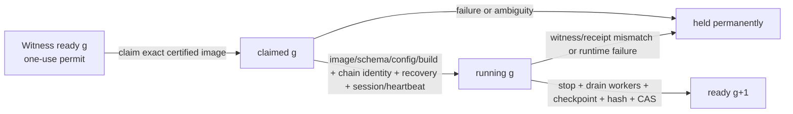
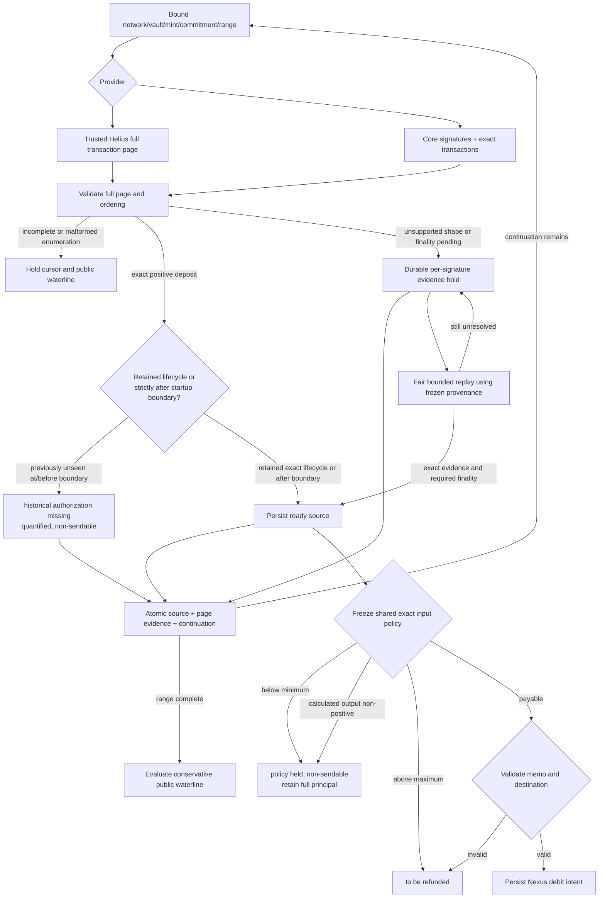
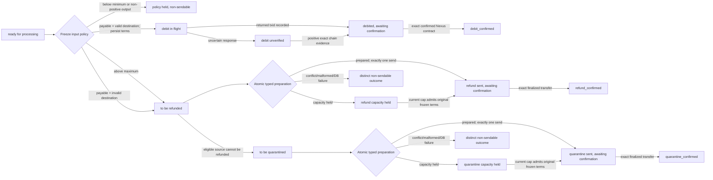
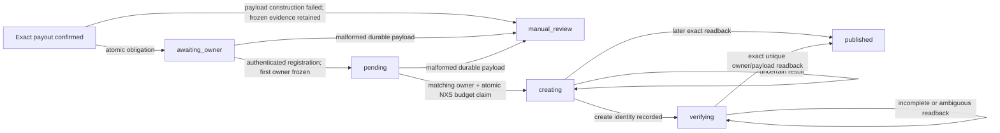

# Swap Service State Machines

## Governing vision and portfolio traceability

Read [the repository vision](../vision.md) and [Distordia alignment/dependency map](DISTORDIA_ALIGNMENT.md) before assigning work. Authority is master Distordia strategy/customer evidence → portfolio roadmap/strategy decisions → repository vision → this architecture → tasks/code/tests/external evidence and human release.

**Portfolio purpose:** O4 attributable settlement and bounded risk; O1 open evidence contracts. Reduce discretionary custody and make exact authorization, liabilities, recovery and finality independently inspectable. The current one-pair operator-custodial bridge is transitional, not non-custodial settlement or company underwriting. The alignment map supplies customer-evidence qualification, batch ownership, upstream prerequisites and human gates. Each material task must name those fields alongside its exact production paths and collected acceptance tests. This documentation alignment changes no runtime, test result or release status; dated evidence below remains evidence for its stated snapshot only.

**Current scope (2026-10-02):** one configured classic SPL token ↔ Nexus token pair.
The committed runtime and documentation-publication base is
`7b2d1c4e3c9d3b2f006a083f9372cfadf80830fc`. The separately reviewed local documentation `HEAD` was
`ee10b6e20dfe85f15347386adecb9dc99db55bb5`; the sealed-custody implementation remained staged and
unpublished. The review comparison base was `ed73c513ee22f9626502273aa0d8e42a4c238b7a`.

Published startup containment now holds four inconsistent restored-source families before workers:
retained ordinary refund/quarantine states, ready rows with debit-submission metadata, ready rows with
capacity siblings, and ready rows with terminal siblings. The unpublished implementation candidate adds a separate witness
for one-use exact SQLite image permits, chain-genesis pins, recovery-before-running, per-cycle lease
checks, quiescent sealing and read-only snapshot dashboard authorization. The complete offline gate for that
unpublished runtime candidate passed 947 tests plus 77 subtests; focused changed-area modules passed 324
tests. These are not test counts for the committed runtime.

**Release remains blocked.** The source fingerprint excludes the executed root `swapService.py` and
installed artifacts; chain admission checks genesis but not health/sync/freshness; the heartbeat validator
does not bind owner/address/pair/custody identity; witness bootstrap/restore operations are incomplete;
and malformed capacity evidence can still starve eligible work. Exact image continuity does not prove
that the initially approved image contains complete liabilities or correct historical authorization.

See [EVALUATION.md](EVALUATION.md), the
[October 2 review](DEVELOPMENT_REVIEW_2026-10-02.md), the
[sealed-custody architecture note](maintenance/sealed-custody-admission.md), the
[current repair plan](plans/2026-09-25-recovery-admission-and-capacity-fairness.md), and the
[historical A/B/C acceptance report](RECOVERY_INPUT_CAP_ACCEPTANCE.md).

Provider-v2, optional receipt enablement and dependency upgrades remain outside this repair. Historical
dated notes are preserved below and in the
[pre-repair snapshot](POST_CHANGE_REVIEW_2026-09-13_PRE_REPAIR_DOCUMENTATION.md); present-tense defect
statements in those snapshots are superseded only where the current sections explicitly say so.

## Safety boundaries

- Immutable token/custody identities and integer base units control financial decisions; symbols
  are display metadata. Existing database columns and status strings remain compatibility contracts.
- Each irreversible action persists its intent and budget before one submission. An uncertain result
  retains its liability and can resolve only through authoritative positive evidence or explicit
  operator disposition; it does not authorize automatic retry/refund.
- A returned signature or finalized status is not sufficient settlement proof. Match transaction
  success, source identity, vault/mint, exact recipient and output against frozen intent.
- Payout completion, fee booking and exact source removal commit atomically. Nexus source identity
  is `(txid, contract_id)` so settling one sibling cannot delete another.
- Incomplete startup recovery prevents every poller/worker from starting. A later reconciliation/exposure
  pause inside an admitted process may continue evidence-only resolution and already-authorized
  refund/quarantine work, but that is a different state and must not be advertised during startup refusal.

## Sealed custody image and process admission

The unpublished local implementation candidate places an external continuity protocol in front of the existing recovery state
machines:



`main.run()` takes the singleton lock, claims before schema creation, verifies the exact file again,
checks both genesis identities, initializes/migrates the database, runs recovery, validates session and
heartbeat, and only then completes the lease. The main loop requires a matching external `running` head
and local live-process receipt before each cycle. Shutdown may seal only after every tracked custody
worker exits; unresolved work permanently holds the generation. The dashboard reports healthy metrics
only from the same running lease before and after one read-only SQLite snapshot.

The certificate binds whole-file hash/size, schema digest, effective public configuration, expected chain
genesis and the current `src/*.py` plus `requirements.txt` manifest. **Current limitation:** that build
fingerprint does not bind executed root `swapService.py`, installed dependencies or the interpreter, so
it is not complete pre-execution artifact attestation. The reference witness also supplies continuity,
not independent proof that an approved image is financially coherent. An externally enforced immutable
artifact and audited bootstrap/restore certificate ceremony are required.

Genesis equality identifies a chain but does not prove node readiness. Current admission still needs
Solana health/root freshness, Nexus synchronization/tip freshness, and exact heartbeat owner/address/
schema/pair/custody/terms validation before mutable startup.

## Startup restore-admission coding contract

Startup owns one `BEGIN IMMEDIATE` audit before either chain rebuild or any worker selection. The replay
boundary and every conservative status change commit together. If any write or validation fails, roll back
the whole audit, report recovery incomplete and call no scanner, reference lookup or financial transport.
Status is not authorization by itself:

| Retained source state | Worker eligibility contract | Current behavior / remaining work |
|---|---|---|
| `ready for processing` | Exact source-matching payable policy; all debit-submission fields SQL `NULL`; no retained disposition-capacity or terminal sibling | Implemented containment: absent/invalid policy, any non-NULL transaction ID/reference/frozen amount, or any capacity/processed/refunded/quarantined sibling becomes `historical_solana_authorization_missing`. Blank, zero, negative and malformed retained values are conflicts, not evidence of no submission. |
| Ordinary refund/quarantine states | A first disposition may be created only inside the admitted live transition that just classified the source; restart may not reconstruct it from current fees or destination | Implemented containment: retained ordinary refund, quarantine and legacy failed-quarantine states are held at startup, even with valid input policy. |
| Capacity-held disposition | Strict frozen source, kind, destination, amount, fee, memo and budget evidence; no source/terminal conflict | Existing validated frozen retries remain eligible. Malformed/conflicting evidence is non-sendable, but the scheduler still lets the oldest malformed row starve later valid work. |
| Debit/disposition in flight, unknown or awaiting confirmation | Resolution-only; never selectable as new work, and completion requires exact positive chain evidence | Existing workers exclude these states. A complete startup audit of missing/conflicting per-state fields remains open. |
| Terminal or competing lifecycle evidence | Exact immutable source identity and settlement proof; no incompatible retained source state | Conflicts must retain principal/evidence and require audited resolution; no startup cleanup may delete them merely because a sibling row exists. |

Every hold must preserve exact integer principal, raw evidence, reservations and remote identifiers; remain
included in liabilities/checkpoint pinning; be visible to operators; and have no manual status-clear or
direct-send bypass. Held rows outside a worker's selector must not consume that worker's limit. Positive
controls must prove that a genuinely new valid source and a coherent frozen retry still progress exactly
once while all held and in-flight rows remain byte-for-byte unchanged apart from the documented status.

## Solana deposit enumeration and holds



Helius is trusted; core RPC is not a mandatory second attestor. Bind provider continuations to
network, vault, mint, commitment and fixed range/query parameters. Never reinterpret a Helius token
as a core `before` signature or resume it under changed query terms.

**Hold requirements:** retain the positive integer principal, exact evidence and immutable provenance.
Include held principal in unresolved backing liabilities; unknown amounts make authorization unhealthy.
Read hold and pending totals in one SQLite snapshot so concurrent promotion cannot omit principal.
Finalized configuration cannot retroactively bless evidence observed at confirmed commitment.
Validate the actual provider endpoint/network before every replay promotion, even when stored
evidence is already finalized and needs no new status request; missing/conflicting endpoints retain the hold.
Status queries obey provider batch limits, and replay cannot repeatedly select only a permanently
unsupported oldest window.

Ordinary classic SPL `transfer` and `transferChecked` share exact vault-balance validation. An outer
ATA creation and its matching inner initialization form one logical creation. Every positive deposit
enters durable liability state before economic admission; processing minimums never filter history.
Before recovery scans, startup atomically advances a monotonic boundary and audits every retained
`ready for processing` row. A ready row is allowed to remain selectable only when strict frozen policy
parses, matches the exact source and says `payable`, its debit transaction ID, reference and frozen
output fields are all SQL `NULL`, and no disposition-capacity or processed/refunded/quarantined sibling
exists. Every other ready row becomes
`historical_solana_authorization_missing` without rewriting evidence or releasing reservations. Both
page committers route a previously unseen source at or before the boundary to a quantified deposit hold,
and automatic hold replay excludes that reason. This boundary is deliberately conservative: offline or
clock-ambiguous deposits may require permanent review, and it is not proof that a partial database is
coherent.

The worker freezes one pure strict-integer policy before destination validation. Classification order
is below minimum, above maximum, non-positive output, then payable. Exact minimum/maximum pass
the size checks, but payout still requires positive output after conversion and fees;
decimal rescaling and flat-plus-basis-point fees use integer floor arithmetic. `MICRO_DEPOSIT_FEE_PCT`
is intentionally unused because no percentage micro-deposit disposition is supported. Below-minimum
and non-positive-output inputs retain full principal and book no fee. Payable invalid destinations and
oversized inputs follow the established refund route. Submitted intent is not reclassified by later
configuration changes while the frozen evidence survives in SQLite. Total-loss recovery is not
equivalent to restart; see the limitation below.

## Public waterlines and database loss

| Evidence | Permitted public waterline behavior |
|---|---|
| RPC error, malformed page, incomplete range or paused/no enumeration | Do not advance |
| In-progress provider continuation | Persist local page progress, not a completed range |
| Unprocessed or held Solana deposits | Pin behind the oldest unresolved source |
| Complete range, all obligations reconstructible | Advance only to the proven bound with safety margin |
| Proposed value does not exceed current value | Leave unchanged |
| Nexus processing-only pass | Never propose a checkpoint |
| Nexus mutable multi-page offset scan | Hold; positive rows do not establish complete enumeration |
| Empty live Nexus enumeration | Hold as unproven absence |

A durable **local** hold can disappear with the database. Keeping the public checkpoint behind it
proves source rediscovery only, not reconstruction of frozen authorization. Empty-custody containment
checks positive heartbeat waterlines before reconstruction and persists
`empty_custody_database_recovery_held` when all recognized source lifecycle/deposit-hold tables are empty.
`main.run()` then starts no poller or worker, and initialization/replay cannot clear the latch.

For a nonempty database, startup persists `solana_recovery_boundary = max(retained boundary,
startup wall clock, Solana waterline)` before either chain rebuild. Both Solana page committers hold an
unseen source whose chain timestamp is at or before that boundary. In the same transaction, every
retained ready row without exact matching payable policy, or with any retained debit-submission field,
becomes a non-sendable historical-authorization row. Every retained ordinary refund/quarantine state is
held as well. These controls close the reproduced current-term disposition path and the path where a valid
policy plus stale ready status allowed a previous debit identity to be overwritten by a second mocked call.

The protocol remains incomplete. Table non-emptiness is not restore proof, the boundary is not an
authoritative chain-clock certificate, and the startup audit is not a schema for every nonterminal status.
Capacity, in-flight/finality and apparently complete pre-fix rows can still lack or conflict with required
lifecycle components without proving a coherent restore. Nexus-side partial reconstruction also remains
outside this Solana containment.

**Required, not yet implemented:** verify a complete restore/deployment identity or transactionally audit
every retained and rediscovered nonterminal lifecycle before any worker selection. Missing or conflicting
historical policy, disposition or submission evidence becomes a quantified, visible, non-sendable recovery
hold. Do not move checkpoints, seed rows or accept table non-emptiness/current terms as history proof. An
audited new bootstrap remains separate from existing-deployment restore.

Nexus startup currently accepts an empty first bounded page while rejecting a later mutable-offset
page. The stricter live-poller rule differs; target-node completeness semantics remain an acceptance
gate, not something local fixtures prove.

## Solana token → Nexus token lifecycle



Unknown Nexus mint outcomes cannot become Solana refunds merely because a bounded lookup is empty.
Capacity-held retries parse and reuse the original destination, output, memo, source, fee and service
terms while coherent database evidence survives. Empty-database loss refuses startup. For a nonempty database, unseen pre-boundary inputs, retained ordinary dispositions, invalid/missing-policy
ready rows and ready rows with debit-submission metadata become historical-authorization holds. With
retained valid frozen-capacity evidence, mutable configuration or address resolution cannot replace terms.

This protection does not yet cover every nonterminal evidence tuple. In-flight/finality/capacity rows and
apparently valid pre-fix combinations still require an all-status audit tied to coherent restore identity.
Admission applies current rolling capacity in global eligible-hold order; individually impossible holds
retain full principal without blocking fitting work.
Lifecycle conflict, malformed evidence, database failure, pre-RPC durable intent and unknown/submitted
outcomes stay distinct and non-sendable. **Current scheduler qualification:** the global oldest-hold query
still includes a malformed oldest row, so it can keep a later valid fitting hold in `capacity held` forever.
This retains liabilities and causes no send, but violates progress; move such rows atomically to a durable
operator-action class outside automatic FIFO before claiming complete retry fairness. Receipt publication
never reopens this payout lifecycle.

## Nexus token → Solana token lifecycle

| Persisted state | Transition rule |
|---|---|
| `pending_receival` | Require complete mapping evidence and authoritative owner/token-account match |
| `ready for processing` | Successful liquidity/admission checks, then atomically freeze payout/fee terms and reserve cap |
| `payout cap held` | Retry admission when capacity is available; no submission occurred |
| `sending` | Single submission claim; ambiguous outcome remains held |
| `sig created, awaiting confirmations` | Require full finalized payout proof matching frozen terms |
| `processed` | Fee, exact terminal evidence and sibling-scoped source removal committed |
| `processed as fees` | Exact per-contract fee classification for the supported dust/minimum policy |
| `refund held for operator review` | No automatic Nexus debit; use the separate audited intent workflow |
| Legacy `collecting refund`, `refund pending`, `trade balance to be checked` | Retain compatibility, resolve/hold conservatively; no blind automatic refund |

Current outgoing payout memos carry `nexus_txid:<txid>:<contract_id>`. Automatic Nexus refund and
quarantine transfers remain disabled. The operator protocol is prepare → named authorization →
execute once → positive chain resolution → exact-source finalize. A submitted txid is immutable;
an unresolved reference-only scan cannot authorize a second debit.

## Recovery and rolling-cap accounting

Current Solana disposition memos are `swapService:v1:refund:<source_signature>` and
`swapService:v1:quarantine:<source_signature>`. Recovery requires exact finalized successful outbound
transfer evidence and the corresponding finalized incoming deposit: source token account, vault,
mint, amount, memo and authoritative chronology. A conflicting active Nexus mint lifecycle holds
reconstruction instead of erasing a possible mint-and-refund conflict. Missing source memos use the
same representation as normal persisted deposits.

Current recovery accepts automatic terminal confirmation only with exact chain proof and strict frozen
authorization provenance. `pre_submission_v1` JSON rejects duplicate keys, non-finite constants,
booleans/integral floats for integer fields, incomplete fields and conflicting values; identifiers are
byte-exact. Valid `legacy_pre_submission_v0` intent remains supported.

At initialization, WAL selection precedes one migration transaction and `BEGIN IMMEDIATE` starts
before schema or data migration. In-place upgrades, SQLite online backups and copied DB+WAL restores
apply this idempotent rule:

```text
terminal + exact proven pre-submission intent + exact chain match
  → preserve/confirm terminal disposition
terminal + absent, malformed, recovery-only or unknown provenance
  → retain proven cap spend + reverse inferred fee/unsafe terminal
  → restore full source principal as refund/quarantine evidence held
  → migration audit + no automatic send
```

Fresh chain-only current-v1 evidence follows the conservative second path. Any DDL/data failure rolls
back the migration and releases the lock. A conflicting active Nexus mint lifecycle also holds
reconstruction rather than erasing a possible mint-and-refund conflict.

Confirmed cap consumption uses chain time, including refunds/quarantine before a newer heartbeat.
The whole rolling window must be covered even when the recovery checkpoint is newer. Known primary
payout identities preserve paid Nexus siblings; unpaid siblings remain independently recoverable.
Unknown, malformed, encoded, legacy or unattributed vault spending keeps recovery incomplete.

## Optional receipt publication state machine



`receipt_contract.py` owns the immutable payload schema and deterministic name. The database still
independently binds receipt fields to the exact completed payout. Owner lookup is not part of payout
finalization. A bound owner cannot be overwritten; mismatches hold publication. Malformed evidence
is retained for manual review, never silently discarded or published.

`creating` is a one-shot boundary: restart reads back and never blindly recreates. Its NXS budget
reservation remains charged across unknown outcomes. Production still rejects receipt enablement
pending live cost, indexing/readback and registration-migration acceptance. Existing fixed-field v1
records cannot gain a receipt schema through a heartbeat update.

## Durable stores and monitoring

| Store | Authority |
|---|---|
| Four `*_sigs` lifecycle tables | Solana source obligations and terminal evidence; evidence-held current-v1 rows remain in `unprocessed_sigs` |
| Four `*_txids` lifecycle tables | Composite Nexus source obligations and terminal evidence |
| Provider cursor/event tables | Bound page continuation and completion evidence |
| `solana_deposit_holds` | Unresolved principal, evidence, provenance and replay state |
| Policy decision/evidence on source rows | Frozen shared economic admission and full-principal policy holds |
| `solana_payout_capacity_holds` | Retryable refund/quarantine cap evidence and original frozen intent |
| `solana_payout_budget_events` | Per-obligation reserved/submitted/confirmed/released cap accounting |
| `solana_disposition_provenance_migrations` | Idempotent conservative migration and reversed-fee audit |
| `recovery_admission_holds` | Narrow durable empty-custody startup latch; absence is not general recovery completion or restore proof |
| `solana_recovery_boundary` | Monotonic timestamp containment for unseen Solana sources; not a restore manifest or authoritative chain-clock certificate |
| `nexus_transfer_intents` / audit events | Immutable operator disposition and attribution |
| `swap_receipts` / `receipt_nxs_budget_events` | Publication obligation and NXS reservation |
| `fee_entries` | Authoritative integer fee journal |

SQLite uses WAL. Use runtime snapshot/accounting APIs rather than hand-summing one ledger. Inspect
source rows, ingestion/policy/cap/evidence holds, migration audit and unresolved reservations together.
Refund/quarantine preparation returns `prepared`, `capacity_held`, `current_cap_too_low`,
`source_conflict`, `malformed_evidence`, `db_failure` or `already_submitted`. Retryable rolling waits
with valid evidence use eligible FIFO order. A frozen payout above the current nonzero cap retains
full principal and requires a reviewed cap change, not merely aging spend; impossible rows cannot
starve fitting work even beyond the worker limit. This guarantee currently excludes malformed or
conflicting oldest holds, which remain safe but can block later automatic progress (R-1b). A
sufficient cap increase or established cap `0` restores eligibility using the unchanged frozen
intent only when that evidence validates. Dashboard/API diagnostics and rate-limited alerts are
emitted after durable transition.
Alert failure cannot erase a hold or cause a send. The audited operator workflow currently covers
only an exact Nexus refund-hold family. Solana policy/evidence/conflict/malformed/unknown-submission
holds lack an equivalent resolution command; do not treat dashboard visibility as that protocol.
**Do not manually edit SQLite or bypass a hold with a direct token send**, including the unsafe
legacy advice in `quarantine_viewer.py`. See R-3 in [the evaluation](EVALUATION.md).

Frozen compatibility examples include `reservations.kind=usdc_to_usdd_debit`, the
`usdc_send:<txid>:<contract_id>` attempt key, legacy fee/table columns and existing status strings.
Do not rename or delete them as cosmetic cleanup while old databases may contain active obligations.

For settings/timeouts see [CONFIG.md](../CONFIG.md); for operator procedures see
[SETUP.md](../SETUP.md) and [SECURITY.md](SECURITY.md). The runtime entrypoints are
`poll_solana_deposits`, `poll_nexus_deposits`, `process_unprocessed_txids`,
`check_unconfirmed_debits`, and `perform_startup_recovery` in their respective `src/` modules.

## Startup identity and admission limitations

Incomplete recovery blocks `main.run()` before pollers. Published source-level containment still audits
unseen/invalid-policy/ordinary/debit/capacity-sibling/terminal-sibling Solana rows and remains necessary.
The unpublished staged external witness adds a general startup outcome: any failure after claim leaves the generation
claimed or permanently held, and the dashboard requires a matching live `running` lease. Summary reads
use one read-only snapshot and do not create a missing database. This supersedes the former stale-healthy
and writable-dashboard defects for the unpublished staged offline candidate.

The stronger continuity gate does not establish initial image completeness. Its build fingerprint omits
the root executable and installed artifacts, while heartbeat validation still accepts an unbound
name-resolved record. Genesis pins do not prove Solana health/root freshness or Nexus sync/tip freshness.
Complete artifact, service-record and node-readiness admission plus independent witness bootstrap/restore
operations remain required before release.

Provider-v2 is committed library code with no production importer. Actual registration, heartbeat and
recovery still use named v1 records; the parsed legacy opt-in flag is not enforced. V2 needs a target-valid
storage layout and exact address/owner/schema/pair/custody validation through every caller before cutover.
See the current register in [the evaluation](EVALUATION.md).

## Preserved dated architecture history

The addenda below are unchanged historical snapshots. Their statements that A/B/C transitions were
missing or partial remain valid for those dated source versions but are superseded for the current
published candidate only within the qualified scope above. They are not production approvals or
final-gate results.

## 2026-09-15 safety-architecture addendum

The state diagrams above remain the committed intended architecture, with these reviewed
qualifications:

1. **Disposition recovery is not yet intent-complete.** Current-v1 refund/quarantine memos bind kind
   and source signature but not frozen output, fee or terms revision. After database loss, exact
   finalized transfer evidence may restore actual rolling-cap spend, but must not by itself authorize
   terminal source removal or classify `source - payout` as fee. Retain a manual-review liability
   until frozen intent survives or a new versioned on-chain identity proves it.
2. **Solana minimum classification is missing after ingestion.** Durable ingestion must continue to
   admit every positive custody delta. Before the `debit in flight` transition, a shared
   live/recovery classifier must apply `MIN_DEPOSIT_SOLANA_UNITS` and the published micro policy.
   Current positive-net below-minimum deposits can reach the Nexus debit boundary.
3. **Disposition cap refusal needs a state.** Capacity exhaustion must persist a distinct retryable
   cap-held state and exact needed/used/cap evidence. Evidence conflicts require a different manual
   hold. A generic ready state plus a log is not an operational safety control.
4. **Provider-v2 remains outside this runtime state machine.** The dirty builder has no registration,
   heartbeat, startup-recovery or waterline caller. Until address-based read/update, exact owner and
   immutable-record validation, monotonic terms updates, secret-safe publication and explicit v1
   fallback are integrated and target-tested, v1 remains the actual runtime contract and v2 remains
   a non-deployable candidate.

See [the full 2026-09-15 review](DEVELOPMENT_REVIEW_2026-09-15.md) for probes, hashes and executable
repair exits. Production and real-fund admission remain hard-blocked.

## 2026-09-16 verification note

Tracked runtime did not change after the September 15 source baseline. The real index still excludes
the dirty provider-v2 proposal, and all paths in the September 15 runtime manifest match. Fresh focused
execution continues to reproduce each qualification above: arbitrary-shortfall v1 recovery can
terminalize a fee, a below-minimum Solana source can reach the Nexus debit boundary, and disposition
cap refusal retains only its generic source state. The isolated v2 library still publishes unenforced
micro percentages and permits a configured secret as a public URL substring.

The full shared-tree suite and configured focused shards remain green; that verifies execution and
isolation, not these architectural exits. See the
[full 2026-09-16 review](DEVELOPMENT_REVIEW_2026-09-16.md). No live-chain acceptance ran.

## 2026-09-17 unresolved-transition clarification

No tracked runtime changed after the preceding note. The following are required transition contracts,
not descriptions of current behavior:

1. **Chain-only current-v1 disposition recovery must not enter a terminal state.** Positive transfer
   evidence may append actual rolling-cap spend, but without frozen intent the source transitions to a
   quantified `manual_review`/unresolved-liability state. It must not enter `refund_confirmed` or
   `quarantine_confirmed`, delete the source obligation or derive a fee from an unexplained shortfall.
   Exact surviving frozen intent or a new pre-submission evidence version is the only automatic path
   from recovered chain evidence to a terminal disposition.
2. **Durable ingestion and economic admission are separate transitions.** Every positive custody delta
   still enters durable state. Before `debit in flight`, one shared classifier must produce an explicit
   below-minimum, boundary or payable outcome using exact integer terms. Live processing and recovery
   consume the same result; ingestion never filters history to enforce economic policy.
3. **Capacity refusal is a state, not a failed claim.** Refund and quarantine preparation must
   atomically persist a typed retryable cap hold containing obligation identity and exact
   needed/used/cap units. Capacity release may return that same obligation to preparation after
   restart. Evidence conflict and lifecycle conflict remain separate manual-review states, and every
   hold transition occurs before any transport send.

The currently collected recovery and cap tests accept the old terminal-fee and generic-state
behaviors, while no collected real-worker test enforces the input threshold matrix. Those tests must
be replaced or extended with the transition contracts above. See the
[full 2026-09-17 review](DEVELOPMENT_REVIEW_2026-09-17.md). Production and real-fund admission remain
hard-blocked.

## 2026-09-21 transition update

`814c0ae` implements the evidence-held transition for a fresh database reconstruction, so the first
September 17 contract is now partly current behavior. Its safe branch is:

```text
current-v1 chain evidence + no surviving disposition row
  → exact observed cap spend
  → full-principal evidence hold
  → no fee, no terminal row, no automatic send
```

The transition is not upgrade-complete. A matching existing terminal disposition row follows the
frozen-intent path regardless of whether it was written before submission or manufactured by the
pre-repair recovery. Add immutable intent provenance and an in-place/backup migration:

```text
existing terminal row + proven pre-submission provenance + exact chain match
  → terminal confirmation
existing terminal row + missing/legacy/recovery-only provenance
  → exact observed cap spend + evidence hold + no inferred fee
```

After that P0 migration, retain the other two September 17 contracts unchanged: shared exact input
classification before Nexus transport, then typed durable cap holds before any refund/quarantine
transport. The [full 2026-09-21 review](DEVELOPMENT_REVIEW_2026-09-21.md) specifies executable exits.
