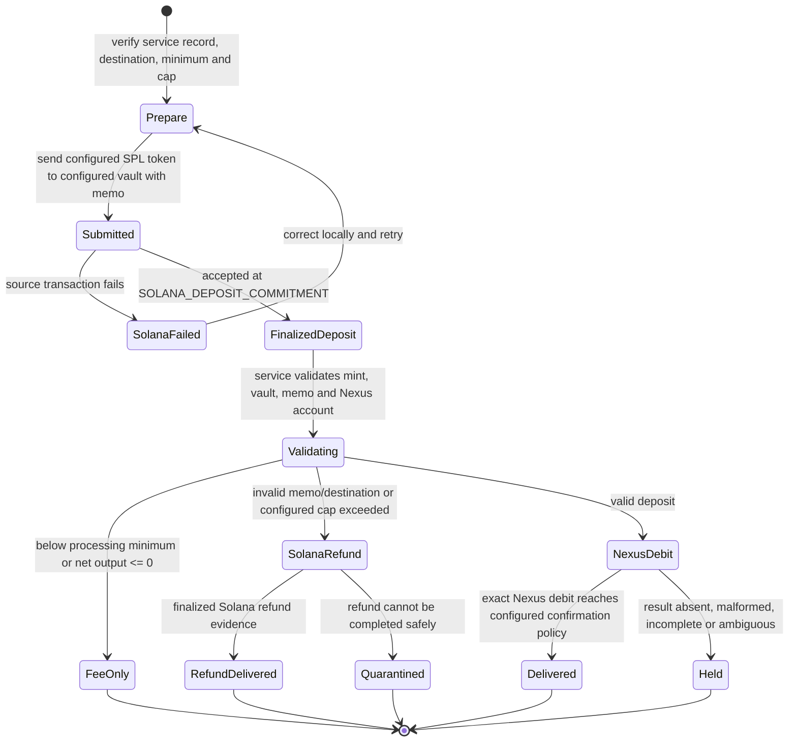
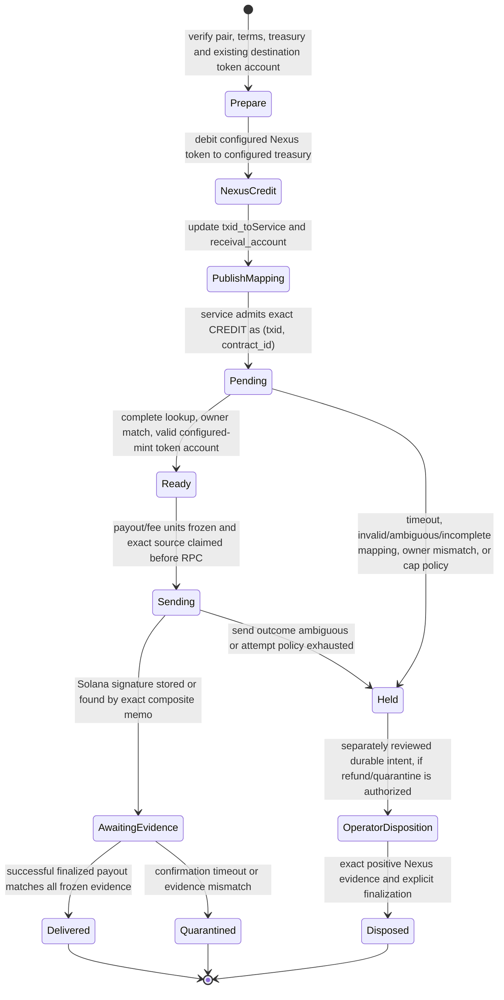

# Swap Initiator State Machines

This document describes the current service from the sender's perspective. One process bridges one
operator-configured pair: one **classic SPL Token Program** mint on Solana and one Nexus token
register. Read the published registration and verify the mint, token register, vault, treasury,
fees, minimums, memo prefix, status, and liveness before sending funds.

`SOLANA_TOKEN_SYMBOL` and `NEXUS_TOKEN_NAME` are display labels. The enforced identities are
`SOLANA_TOKEN_MINT` and `NEXUS_TOKEN_REGISTER_ADDRESS`; custody addresses are
`SOLANA_VAULT_ACCOUNT` and `NEXUS_TREASURY_ACCOUNT`. Token-2022, multiple simultaneous pairs, and
chains other than Solana are not implemented.

## Solana token → Nexus token

The sender transfers the configured SPL token to the configured vault and attaches:

```text
<DEPOSIT_MEMO_PREFIX><YOUR_NEXUS_TOKEN_ACCOUNT_ADDRESS>
```

The default prefix is `nexus:`, but users must read the operator's published `memo_prefix` rather
than assume that default.

### Initiator flow



| Initiator view | Persisted service state | Meaning |
|---|---|---|
| Deposit detected | `unprocessed_sigs`: `"ready for processing"` | Waiting for validation and Nexus debit |
| Nexus debit submitted | `"debit in flight"` → `"debited, awaiting confirmation"` | Submission is not finality |
| Debit outcome unclear | `"debit unverified"` | Held for positive txid/reference evidence; never guessed |
| Delivered | `processed_sigs`: `"debit_confirmed"` | Exact debit evidence met the configured positive Nexus confirmation threshold |
| Returned on Solana | `"to be refunded"` → `"refund sent, awaiting confirmation"` → `"refund_confirmed"` | Refund is settled only from finalized Solana evidence |
| Manual review | quarantine statuses/tables | No blind retry or double payment |

An RPC/CLI failure, timeout, or unparsable Nexus result is **not** proof that the debit failed. The
service retains the pre-call reference and holds until positive evidence resolves the outcome. It
does not automatically refund a Solana deposit merely because the Nexus debit could not be observed.

### User checklist

1. Verify the current named registration/heartbeat is fresh and its `status` permits use.
2. Verify `solana_vault_mint=<SOLANA_TOKEN_MINT>` and the published vault address.
3. Verify the Nexus token register and create the destination Nexus token account.
4. Read `memo_prefix`, `fee_flat_to_nexus`, `fee_bps`, and `min_to_nexus` from the current v1
   registration created by `register_service.py`.
5. Send the configured classic SPL token to `<SOLANA_VAULT_ACCOUNT>` with memo
   `<DEPOSIT_MEMO_PREFIX><YOUR_NEXUS_TOKEN_ACCOUNT_ADDRESS>`.
6. Treat only the Nexus account balance/transaction as delivery evidence. If neither delivery nor a
   finalized Solana refund appears, contact the operator; do not resend the same deposit.

## Nexus token → Solana token

The sender first creates a reusable Nexus mapping asset with the literal compatibility fields
`txid_toService` and `receival_account`. `receival_account` must be an **existing classic SPL token
account for `SOLANA_TOKEN_MINT`**. The current runtime does not derive an ATA from a wallet address
and does not create token accounts.

### One-time mapping asset

```bash
nexus assets/create/asset name=<USER_MAPPING_ASSET_NAME> format=basic \
    txid_toService="" \
    receival_account=<EXISTING_SOLANA_TOKEN_ACCOUNT> \
    pin=<YOUR_PIN>
```

`toChain`, `fromToken`, `toToken`, and `distordiaType` are optional legacy metadata. The runtime does
not use them to select a chain or pair.

### Per-swap actions

```bash
nexus finance/debit/account from=<YOUR_NEXUS_TOKEN_ACCOUNT> \
    to=<NEXUS_TREASURY_ACCOUNT> amount=<AMOUNT> pin=<YOUR_PIN>

nexus assets/update/asset name=<USER_MAPPING_ASSET_NAME> format=basic \
    txid_toService=<RETURNED_NEXUS_TXID> \
    receival_account=<EXISTING_SOLANA_TOKEN_ACCOUNT> \
    pin=<YOUR_PIN>
```

Use `finance/debit/account`, not `finance/debit/token`; the latter acts on token supply authority.
The mapping asset's built-in `owner` must match the sender's Nexus genesis owner.

### Initiator flow



| Initiator view | Persisted service state | Meaning |
|---|---|---|
| Credit waiting for mapping | `"pending_receival"` | Lookup may be retried only from this admission state |
| Ready | `"ready for processing"` | Owner and destination token account validated |
| Payout submitted/unknown | `"sending"` / `"sig created, awaiting confirmations"` | `payout_solana_units` and `payout_fee_nexus_units` are frozen before RPC |
| Delivered | `processed_txids`: `"processed"` | Successful finalized transaction matches exact source, memo, signer/vault, mint, recipient and amount |
| Held | `"refund held for operator review"` or legacy `"refund pending"`, `"collecting refund"`, `"trade balance to be checked"` | No automatic Nexus refund or treasury-to-quarantine debit |
| Manual review | `"quarantined"` | Solana payout may already exist; never assume failure from timeout |

New payouts carry `nexus_txid:<txid>:<contract_id>`. The older txid-only memo is legacy and cannot
identify sibling CREDIT contracts safely. A signature, memo match, or confirmation status alone is
not completion: the service requires successful finalized transaction evidence matching the frozen
source and payout terms.

`REFUND_TIMEOUT_SEC` changes an unresolved mapping into an operator hold; it does **not** promise an
automatic refund. An authorized Nexus refund or quarantine is a separate intent-first operator
workflow (`prepare`, `authorize`, one `execute`, `resolve`, `finalize`) that binds the exact
`(source_txid, source_contract_id)` and requires positive chain evidence.

## Fees, minimums, dust, and caps

Amounts are not fixed to historical USDC/USDD defaults. Read the current service record and operator
configuration. Canonical settings are `FEE_FLAT_TO_NEXUS`, `FEE_FLAT_TO_SOLANA`,
`FEE_REFUND_SOLANA`, `FEE_BPS`, `MIN_DEPOSIT_SOLANA_TOKEN`, `MIN_CREDIT_NEXUS_TOKEN`, and
`DUST_CREDIT_NEXUS_TOKEN`. The effective processing minimum is at least twice the corresponding
output flat fee. Nexus credits below the dust threshold are intentionally not persisted; credits at
or above dust but below the processing minimum are durably recorded and processed as fees.

Some exposure-cap environment names and persisted amount columns retain `USDC`/`USDD` for
compatibility (`MAX_SWAP_USDC`, `MAX_SWAP_USDD`, `DAILY_PAYOUT_CAP_USDC`, `amount_usdc_units`,
`amount_usdd_units`). Their values apply to the configured Solana/Nexus pair; do not rename them in
an existing database or operational procedure without a migration.

## Recovery, waterlines, and heartbeat

The current runtime resolves its heartbeat by `NEXUS_HEARTBEAT_ASSET_NAME`. A fresh
`last_poll_timestamp` is liveness evidence, not settlement or proof of catch-up. On startup, both
configured top-level waterlines must be positive and reconstruction on both chains must be complete;
otherwise the service aborts before pollers or exposure-producing activity. Live empty Nexus
enumeration and mutable nonzero-offset pagination hold the Nexus checkpoint.

## References

- Internal states and literal compatibility values: [STATE_MACHINES.md](STATE_MACHINES.md)
- User and provider assets: [ASSET_STANDARD.md](../ASSET_STANDARD.md)
- Configuration: [CONFIG.md](../CONFIG.md)
- Security controls: [SECURITY.md](SECURITY.md)
